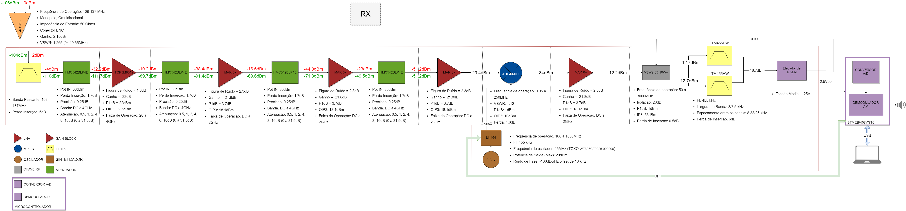
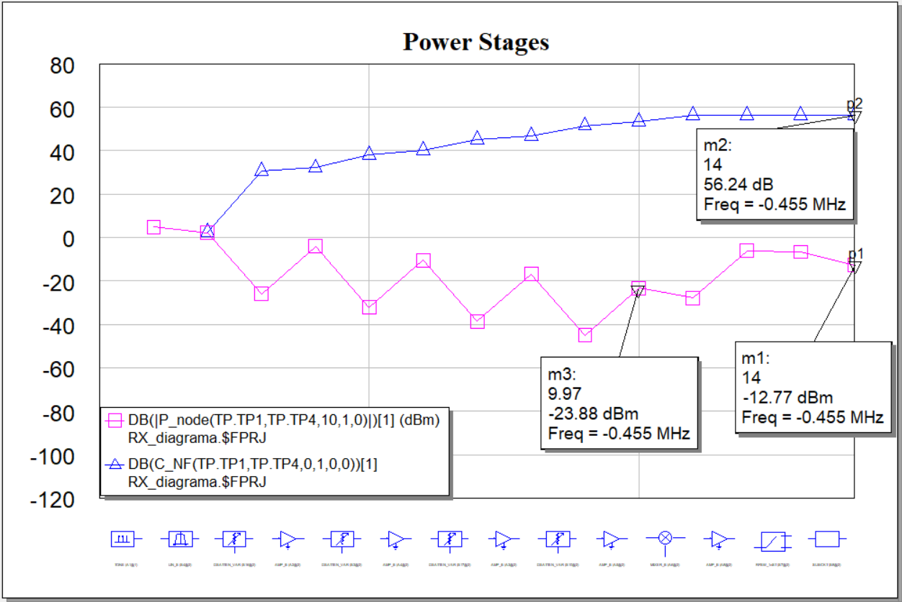
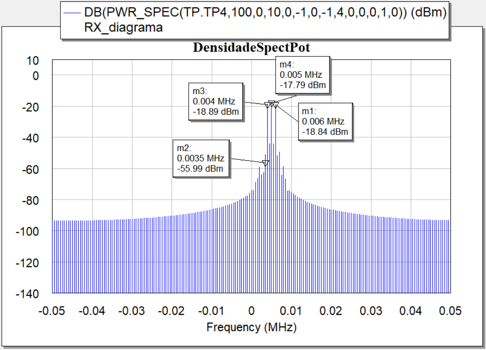

# Integra-Projeto
Este bloco tem como objetivo realizar a integração dos dispositivos da cadeia de recepção para um rádio VHF 108-137MHz, para comunicação aeronáutica, empregando modulação AM.

O projeto deve seguir as seguintes especificações:

As instruções detalhadas sobre o projeto são estabelecidas [nesta apresentação](Trabalhos.pdf)

## Descrição do projeto
A cadeia de recepção tem sua arquitetura baseada em receptores heteródinos e deve ser capaz de detectar sinais de voz a partir de 0dBu (equivalente a -106.5dBm em potência) na faixa de 108 a 137MHz. Com uma frequência intermediária de 455kHz, o usuário é capaz de selecionar entre bandas de largura 3kHz, com um espaçamento de 8.33kHz, ou bandas de 7.5kHz com espaçamentos de 25kHz.

O sinal é entregue a um microcontrolador STM32F407VGT6 para demodulação e, em seguida, envio para as saídas de áudio. A potência de entrada do sinal será ajustada através de um controlador PID, implementado no mesmo microncontrolador, que se comunica através de protocolo SPI com 4 atenuadores variáveis. A malha de ajuste automático do ganho deve garantir uma potência de -28dBm para a entrada do Mixer.

O microcontrolador também fará o ajuste da potência de saída do sintetizador, através de protocolo SPI, e deve ter a frequência de amostragem do seu conversor A/D configurada para um valor que atenda ao critério de Nyquist para a demodulação (>=2FI). O ajuste da potência deve garantir que o sintetizador entregue 7dBm para o Mixer.

## Divisão de tarefas
As descrições detalhadas de cada bloco do projeto pode ser vistas nos seguintes repositórios:

1 - Antena: [Mariana](https://github.com/apct-2019/Mariana)

2 - Filtros: [Nicolas Oliveira](https://github.com/apct-2019/Nicolas)

3 - Atenuadores: [Mendes](https://github.com/apct-2019/Mendes)

4 - LNA/Gain Block: [Arturo](https://github.com/apct-2019/Arturo)

5 - Mixer: [Sampaio](https://github.com/apct-2019/Sampaio)

6 - Oscilador Local: [Bacelar](https://github.com/apct-2019/Bacelar)

7 - Conversor A/D e Firmware: [Aquino](https://github.com/apct-2019/Aquino)

8 - Integração do Projeto: João Carvalho

9 - Layout e Componentes de Características Distribuídas: [Onias](https://github.com/apct-2019/Onias)

## Diagrama de Blocos

## Parâmetros Críticos
* Com esta cadeia de recepção, nenhum dos amplificadores está em região de saturação, ou seja, suas potências de saída estão abaixo do P1dB e distantes do OIP3;
* Devido ao atenuador na entrada, têm-se um grande aumento na figura de ruído do circuito para situações de alta potência de entrada. Porém, através das simulações podemos ver que, mesmo alto, ainda é um valor aceitável;
* O Mixer selecionado apresenta uma boa operação para a potência de entrada LO=+13dBm. Por isto, a potência do sintetizador deve ser ajustada para atender tal valor;
* A FI foi selecionada para 455kHz para atender a capacidade de amostragem do microcontrolador e evitar que sinais de canais indesejados interfiram na comunicação do canal de interesse;
* Com o ajuste da potência de entrada do Mixer, ajusta-se também a potência de entrada no microcontrolador, que pode ter seu pico em até 20.9dBm (2.5V, para Z=50ohms). Para isto, utiliza-se um circuito elevador de tensão para gerando um offset de 1.25V.

## Simulações em AWR
As simulações a seguir mostram, respectivamente:
* A potência do sinal (em rosa) e a figura de ruído (em azul), a cada estágio do repector, da antena à entrada do mixer, para um sinal com potência de 0dBm;
* O espectro de potência do sinal na saída do filtro de canal, para uma potência de entrada de 0dBm.

Nas simulações, o ajuste automático das atenuações foi calculado feito da seguinte forma:
* Todos os atenuadores recebem o mesmo sinal "ctrl" como parâmetros para a atenuação, assim o mesmo sinal de SPI pode ser usado para configurar todos. Este valor indica quantos passos de atenuações devem ser utilizados;
* Para uma potência de entrada, chamemos de Pin, de -106dBm, deseja-se ter 0 de atenuação. Idealmente, isto leva a um sinal com -29.4dBm de potência na entrada do mixer;
* Para uma potência de entrada de 0dBm (especificado como o limite deste projeto), deseja-se que a potência entregue ao mixer também seja de -29.4dBm, o que implica em atenuações de 26.5dBm;
* Com isto, pode-se fazer uma "regra de 3" para chegar a conclusão que: ctrl = 0.5\*Pin+68

O projeto com as simulações se encontra neste repositório e, para mudar a potência de entrada do circuito, basta alterar o parâmetro Pin_dBm, que está na equação do "System Diagram": RX_diagrama
